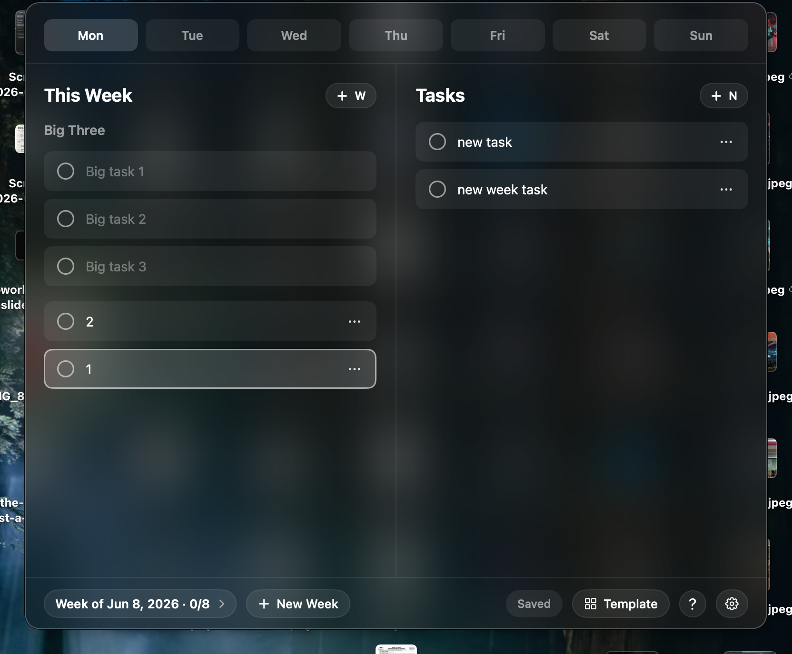
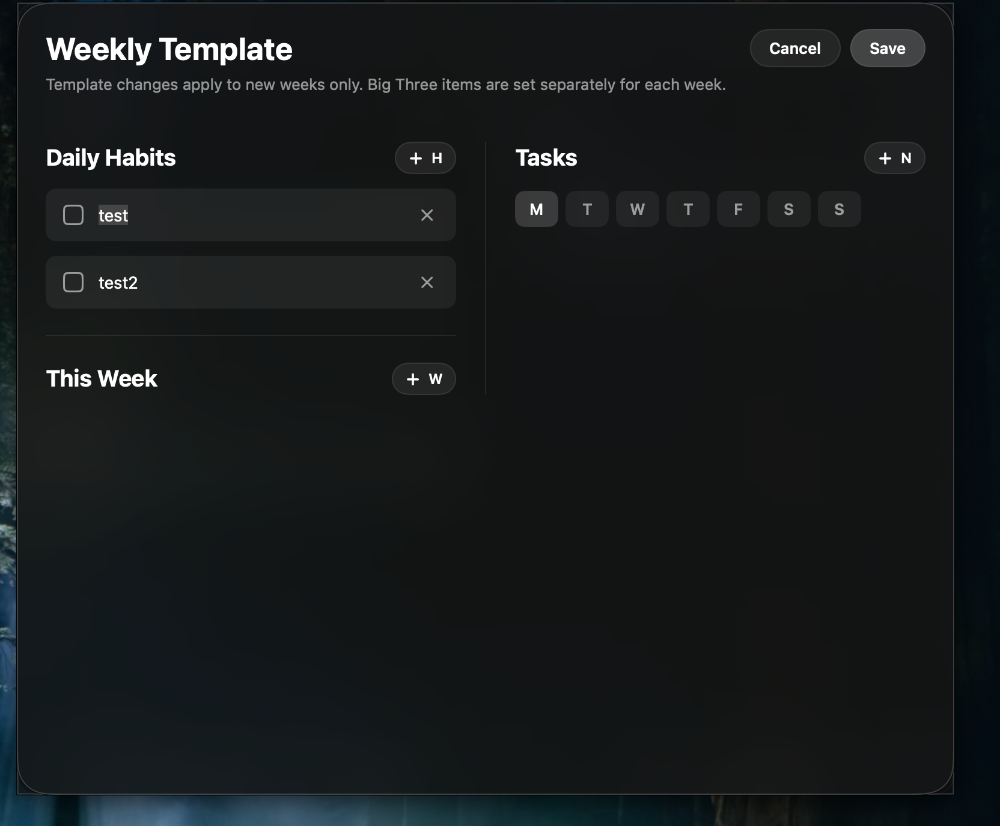
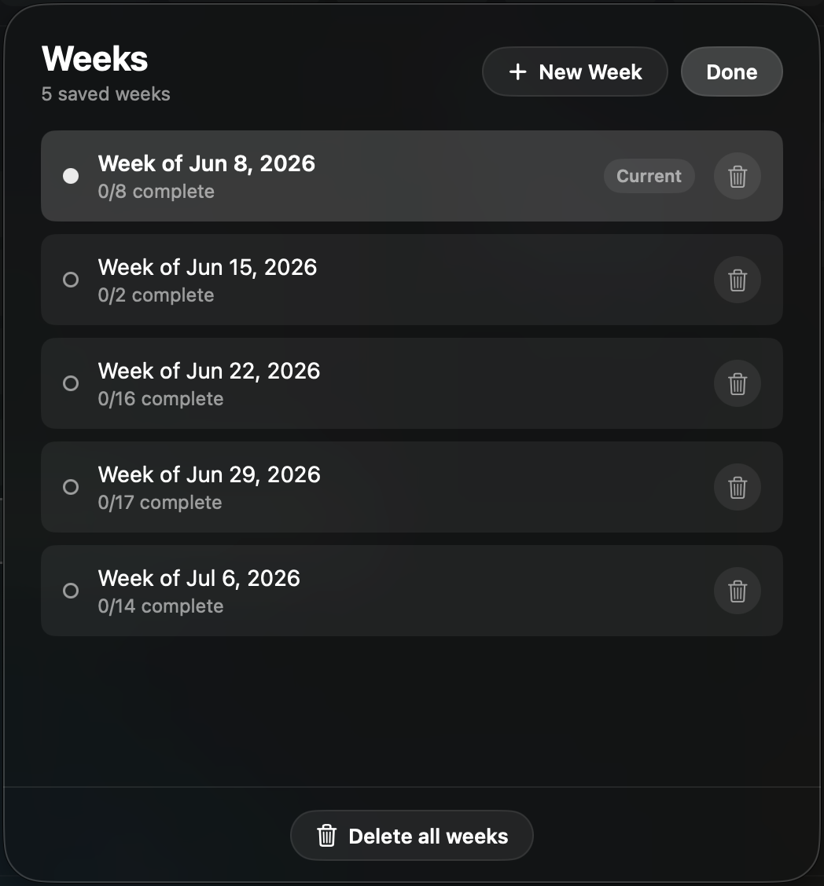

# Taskbar

Taskbar is a local macOS menu bar application for planning a week of tasks,
built with SwiftUI. It is a compact dark glass popover that opens from the menu
bar, saves to a local JSON file, and shows no Dock icon.

It is fully keyboard navigable — you can move between every task, switch days,
add and rename tasks, and move tasks between days without touching the mouse.

## Screenshots

The weekly view: day tabs across the top, the undated **This Week** list and
**Big Three** on the left, and the selected day's habits and tasks on the right.



The **Weekly Template** seeds every new week with recurring habits and tasks:



The **Weeks** panel lists every saved week for quick switching and bulk deletion:



## Layout

- **Day tabs (top):** Monday through Sunday. The active day drives the Tasks
  panel. Each tab shows the number of completed tasks for that day.
- **This Week (left panel):** the per-week **Big Three** slots, plus undated
  tasks for the week. Create a task here when there is no specific day to do it
  on, then push it into a day later.
- **Tasks (right panel):** the active day's habit checkboxes (one set per day,
  completed independently each day) followed by that day's tasks.
- **Bottom bar:** a week pill showing the current week and its `done/total`
  completion count (tap it to open the Weeks panel), a **New Week** button,
  save status, and buttons for the Template editor, keyboard help, and settings.

## Weeks panel

Tap the week pill in the bottom bar to manage every saved week in one place:

- The current week is marked. Click any week to switch to it.
- Each week has its own trash button for instant deletion.
- **Delete all weeks** clears everything and starts a fresh current week.

There is always at least one week — deleting the last one recreates the current
calendar week.

## Weekly Template

The template pre-creates recurring items for every new week:

- **Daily Habits** — each day of a new week gets one unchecked habit per name.
- **This Week** — undated recurring tasks for the week.
- **Tasks** — recurring tasks per day.

Template edits apply to new weeks only. The Big Three is per-week and starts
empty; it is not part of the template.

## Keyboard shortcuts

| Key | Action |
| --- | --- |
| Up / Down | Move within a column; Up from the top task jumps to the day tabs |
| Left / Right | Move between the This Week and Tasks columns |
| Left / Right (on the habits row) | Move between habit checkboxes |
| Left / Right (on day tabs) | Switch the active day; Down returns to the column |
| Tab / Shift-Tab | Cycle region: Day tabs, This Week, Tasks |
| Shift-Left / Shift-Right | Move the selected task across days (This Week ↔ Mon…Sun) |
| Shift-Up / Shift-Down | Reorder the selected task within its list |
| Space | Toggle the selected task or habit complete |
| Return or R | Rename the selected task (double-click also works) |
| W | New This Week task |
| N | New task in the selected day |
| Delete | Delete the selected task (clears a Big Three slot) |
| Cmd-N | New week |
| T | Open the weekly template |
| ? | Show the shortcuts list |
| Esc | Cancel a rename, or close the popover |

## Build and run

From this repository root:

```sh
./build.sh
open build/Taskbar.app
```

The build script compiles the Swift sources directly with `swiftc` and
assembles a proper `.app` bundle with `LSUIElement=true`, so the application
runs as a menu bar accessory. (Swift Package Manager's manifest step does not
link on a machine with only the Xcode Command Line Tools, so `swift build` is
not used.)

To build, install to `/Applications`, and relaunch in one step:

```sh
./build.sh --install
```

To quit the application, press **Cmd-Q**, or use Quit Taskbar in Settings.

## Data storage

Taskbar stores everything locally:

```text
~/Library/Application Support/Taskbar/data.json
```

There is no server, account, analytics, or cloud synchronization.
